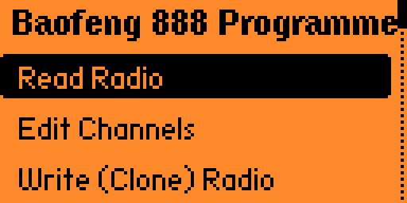
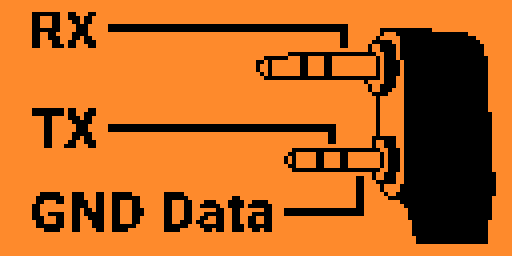

# Flipper Baofeng/Retevis Programmer

A Flipper Zero application to read, edit, and clone memory for Baofeng BF-888S, Retevis H777, and other compatible radios (using the Baofeng 1-pin serial protocol).

> [!WARNING]
> **DISCLAIMER**: This application is currently UNTESTED on real hardware. It was built based on protocol specifications and reverse engineering. Use it entirely at your own risk. The authors are not responsible for any damage, bricked radios, or loss of data.

## Features

* **Full EEPROM Read/Write**: Reads and writes the entire 992-byte EEPROM, preserving system settings (VOX, Squelch, Battery Saver, etc.).
* **On-device Channel Editing**: Edit TX/RX frequencies (with 10Hz precision), CTCSS/DCS tones, TX Power, Bandwidth, Scan Add, Beat Shift, and BCL directly on your Flipper Zero.
* **CHIRP `.img` Compatibility**: Backups are saved in a fully compatible CHIRP-next `.img` format, allowing you to seamlessly edit your Flipper dumps on a PC.
* **Legacy Support**: Can load older `.dat` or `.bf8` (256-byte) channel-only dumps and inject them into the active memory map without overwriting system settings.

## Screenshots

| Main Menu | Channel Editor | Wiring/Features |
|:---:|:---:|:---:|
|  |  |  |

## Hardware Requirements

To connect your Flipper Zero to the radio, you will need a Kenwood 2-pin style cable or a custom 1-pin Baofeng cable, wired to the Flipper's GPIO pins:



* **Radio TX (Data Out)** -> **Flipper RX (Pin 14)**
* **Radio RX (Data In)** -> **Flipper TX (Pin 13)**
* **Radio GND** -> **Flipper GND (Pin 8 or 11)**

*Note: Ensure the radio is powered on and connected properly before attempting to read or write.*

## Installation & Compilation

You can compile this application using [ufbt (Micro Flipper Build Tool)](https://github.com/flipperdevices/flipperzero-ufbt).

```bash
ufbt launch
```

Or you can use the provided GitHub Actions workflow to automatically build the `.fap` file.

## Usage

1. **Read Radio**: Downloads the current EEPROM memory from the connected radio.
2. **Edit Channels**: Opens an intuitive menu to modify any of the 16 channels.
3. **Write (Clone) Radio**: Uploads the current memory map back to the radio.
4. **Save to SD**: Saves a CHIRP-compatible `dump.img` backup to your Flipper's SD card (`/ext/baofeng/dump.img`).
5. **Load from SD**: Restores a previously saved memory dump from the SD card.

## Credits

Created by Delliaf.

Based on CHIRP reverse engineering of the Baofeng/Retevis protocol.
